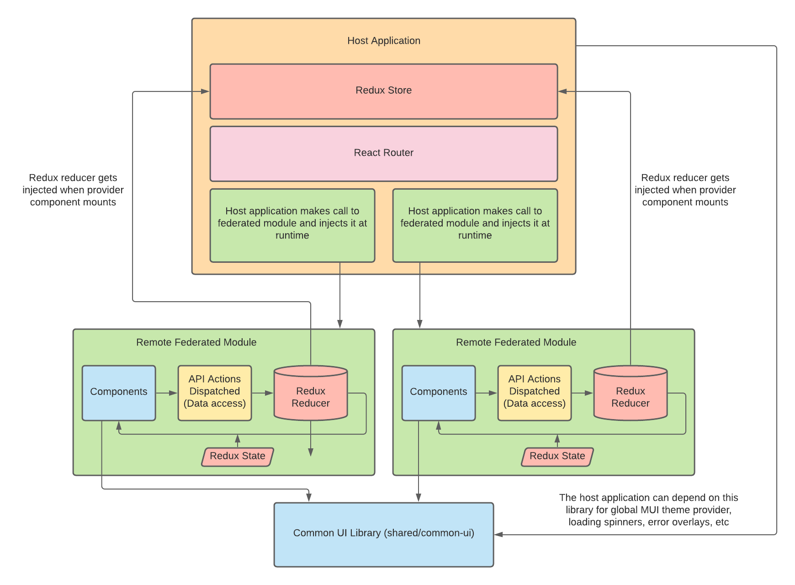

# Architecture

<div align="center" style="padding: 20px">
    
</div>

## Directory/File Structure

```
📦 apps
 ┣ 📂 connect
 ┃ ┣ 📂 src
 ┃ ┃ ┣ 📂 app
 ┃ ┃ ┃ ┣ 📜 App.tsx
 ┃ ┃ ┃ ┣ 📜 Providers.tsx
 ┃ ┃ ┃ ┣ 📜 Routes.tsx
 ┃ ┃ ┃ ┗ 📜 store.ts
 ┗ ...other apps
📦 mfe
 ┣ 📂 contacts
 ┃ ┣ 📂 src
 ┃ ┃ ┣ 📂 common-ui
 ┃ ┃ ┣ 📂 feature-core
 ┃ ┃ ┃ ┗ 📂 components
 ┃ ┃ ┃ ┗ 📂 hooks
 ┃ ┃ ┃ ┗ 📜 contacts.slice.ts
 ┗ ...other micro frontends
 📦 shared
 ┣ 📂 common-ui
 ┃ ┣ 📂 src
 ┃ ┃ ┣ 📂 components
 ┗ ...other shared libs
```

- Apps contain all of our applications that would get deployed
  - Should have an app folder that describes all of the application's routes and reducers
  - They should not contain any components, services, or business logic and only wire up shared micro frontends
  - They are basically just the glue that holds everything together
- MFE contain code that should be shared to build up applications
  - Can contain a common-ui folder that contains shared components that relate only to the micro frontend
  - Micro frontends should be split by business domain and have a set of features that relates only to that micro frontend
    - A feature should be a set of components, hooks, and a redux slice
    - Directory should be named like `feature-{feature name}`
    - Features should not be nested inside each other
    - It might take multiple features to actually make up a whole view
- Shared are more common components and utilities
  - Common-ui would just be shared presentational components (dumb components) or components that just use local state
    - Usually components are created in their respected library, but once they need to be shared between multiple libraries they should be made more generic and put in common-ui
  - Utilities library for maybe test or helper functions

This similar type of file structure is strongly recommended in the [Redux style guide](https://redux.js.org/style-guide/style-guide#structure-files-as-feature-folders-or-ducks) and has personally worked very well for me for years in large frontend react projects.

## Component Folder Structure

```
📂 components
 ┣ 📜 Rating.stories.tsx
 ┣ 📜 Rating.test.tsx
 ┣ 📜 Rating.tsx
```

It should be very easy to locate everything related to a component (story, test and styles). Styles and stories shouldn't be nested away in their own directories. Although it is from John Papa's AngularJS style guide I am a big fan of the [LIFT principle](https://github.com/johnpapa/angular-styleguide/blob/master/a1/README.md#lift).

## Redux

This application uses [redux toolkit](https://redux-toolkit.js.org/) which is the official optionated toolkit created by the maintainers of redux. It is a great approach to writing redux code because it reduces boilerplate and has a great API to reduce complexity. The application also features the concept of [injectable redux reducers](https://redux.js.org/recipes/code-splitting/#defining-an-injectreducer-function).

Following [the redux style guide](https://redux.js.org/style-guide/style-guide) is also very important.

## Typescript

This application also uses [Typescript](https://www.typescriptlang.org/). I've been using it in professional applications since the AngularJS 1.x days. You don’t need to use crazy advanced types, but leveraging just the TS compiler and having types instead of prop-types can reduce bugs and make for a better developer experience. It also allows for better refactoring and helps to establish interfaces for API payloads.
