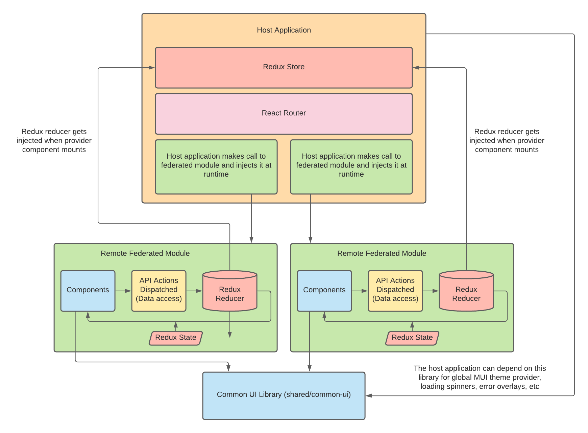

# Micro Frontend with Webpack 5 Module Federation

This is the same pets demo application that I have in other repos, but this one demonstrates [Webpack 5 Module Federation](https://webpack.js.org/concepts/module-federation/). Both `remote/nav` and `remote/pets` are federated modules. The idea being that the federated modules are features that build up app functionality and require frequent updates. While everything in `shared` directory are libraries that can help build up a federated module (utilities and shared components). The host application that serves these modules is in `apps/cats`. The application also features the concept of injectable redux reducers.

I put this all together in a monorepo using NX. I find this to be a better workflow than splitting modules into separate repos. Having both applications and modules living together in the same repo while using some monorepo tooling (Lerna/NX/Rush) to manage it all is a great developer experience in my opinion. Instead of fighting with `npm link`, managing multiple repos, and running multiple commands, just running one command to get started with development is very nice.

It also cuts down on having to create multiple PRs. This way you don’t have to worry about the overhead of publishing/updating packages and other team members can gain full scope of the changes when reviewing a PR. In my experience there should be very little need to even publish a package unless an application depends on something inside of the monorepo.

## Getting started

This monorepo is using NX and pnpm workspaces. So make sure you install pnpm first and having NX won't hurt:

```
npm i pnpm nx -g
```

Then in the root directory just run the following commands to start the app and json-server:

```
pnpm i && pnpm run start
```

Then navigate to `http://localhost:1337`

If you want to just run a shared module you can do either of these if you have NX installed globally. From the root directory run the following and just replace `remote_nav` or the directory with the module you want to run:

```
nx run remote_nav:start
cd shared/nav && pnpm run start
```

## Architecture Diagram

<div align="center" style="padding: 20px">
    
</div>

## More Info

- https://module-federation.github.io/
- https://webpack.js.org/concepts/module-federation/
- https://redux.js.org/recipes/code-splitting#reducer-injection-approaches
- https://nx.dev/react/
- https://pnpm.js.org/

## Todo

- Probably more optimizations to the webpack configs
- Think about how versioning should work with federated modules
- Look into [redux-dynamic-modules](https://github.com/Microsoft/redux-dynamic-modules)
- Look into [single-spa](https://single-spa.js.org/) if even needed
- Keep an eye on [HMR](https://github.com/pmmmwh/react-refresh-webpack-plugin/issues/126)
- Probably something else I'm forgetting...
